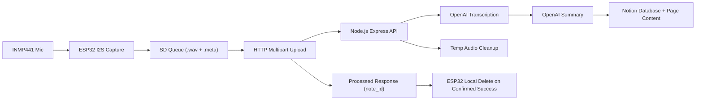

# Architecture

## Data flow

## Lifecycle guarantees

1. Recording is written to SD incrementally, not buffered in RAM.
2. Each note has a `.wav` and `.meta` sidecar in `/queue`.
3. Upload attempts occur:
   - on boot
   - after recording stop
   - periodically while idle
4. Local deletion only occurs after backend response confirms:
   - `status = processed`
   - matching `note_id`
5. Backend deletes temporary upload files in `finally` for both success and error paths.

## State model (`.meta`)

- `ready`: waiting to upload
- `uploading`: in-flight upload (downgraded to `error` on reboot recovery)
- `done`: processed by backend
- `error`: failed last attempt; eligible for retry

## Backend components

- `POST /api/v1/notes/upload`: authenticated multipart endpoint.
- `OpenAIService`: transcription + summary generation.
- `NotionService`: metadata properties + transcript blocks write.
- `CleanupService`: guaranteed temp-file delete.

## Constraints

- Single-device class prototype.
- Synchronous processing API call (device waits for final result).
- 5-minute max recording duration.
- 16kHz mono WAV only.
